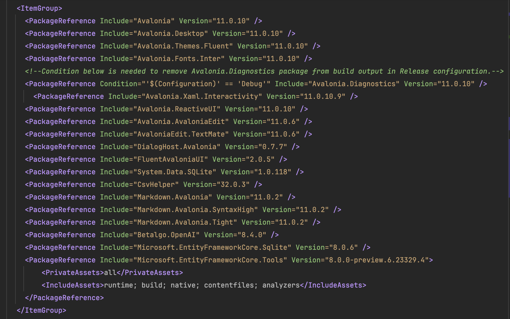

# TerraMours.Chat.Ava
基于Avalonia的智能AI会话项目，接入ChatGpt
## 1.nuget包引用



### 引用包介绍：

* Avalonia  版本11.0.8，稳定版本，其他基于avalonia的包要选用支持11.0.8的版本

* Avalonia.ReactiveUI  MVVM 架构模式的工具库，创建avalonia项目时会提示选择。

* [DialogHost.Avalonia](https://www.nuget.org/packages/DialogHost.Avalonia)  它提供了一种简单的方式来显示带有信息的对话框或在需要信息时提示用户。

* FluentAvaloniaUI   UI库，并将更多WinUI控件引入Avalonia

* System.Data.SQLite  本地数据库SQLite

* CsvHelper Csv导入导出工具库

* [Markdown.Avalonia](https://www.nuget.org/packages/Markdown.Avalonia)  用于显示markdown文本的工具，用于展示聊天结果的渲染

* Betalgo.OpenAI  调用ChatGpt的扩展库

  

```xml
<PackageReference Include="Avalonia" Version="11.0.10" />
<PackageReference Include="Avalonia.Desktop" Version="11.0.10" />
<PackageReference Include="Avalonia.Themes.Fluent" Version="11.0.10" />
<PackageReference Include="Avalonia.Fonts.Inter" Version="11.0.10" />
<!--Condition below is needed to remove Avalonia.Diagnostics package from build output in Release configuration.-->
<PackageReference Condition="'$(Configuration)' == 'Debug'" Include="Avalonia.Diagnostics" Version="11.0.10" />
<PackageReference Include="Avalonia.Xaml.Interactivity" Version="11.0.10.9" />
<PackageReference Include="Avalonia.ReactiveUI" Version="11.0.10" />
<PackageReference Include="Avalonia.AvaloniaEdit" Version="11.0.6" />
<PackageReference Include="AvaloniaEdit.TextMate" Version="11.0.6" />
<PackageReference Include="DialogHost.Avalonia" Version="0.7.7" />
<PackageReference Include="FluentAvaloniaUI" Version="2.0.5" />
<PackageReference Include="System.Data.SQLite" Version="1.0.118" />
<PackageReference Include="CsvHelper" Version="32.0.3" />
<PackageReference Include="Markdown.Avalonia" Version="11.0.2" />
<PackageReference Include="Markdown.Avalonia.SyntaxHigh" Version="11.0.2" />
<PackageReference Include="Markdown.Avalonia.Tight" Version="11.0.2" />
<PackageReference Include="Betalgo.OpenAI" Version="8.4.0" />
<PackageReference Include="Microsoft.EntityFrameworkCore.Sqlite" Version="8.0.6" />
<PackageReference Include="Microsoft.EntityFrameworkCore.Tools" Version="8.0.0-preview.6.23329.4">
<PrivateAssets>all</PrivateAssets>
<IncludeAssets>runtime; build; native; contentfiles; analyzers</IncludeAssets>
</PackageReference>
```


## 2.功能介绍

项目开发的功能分为如下：

### 1.通用框架：

* VMLocator: ViewModel 定位器。方便地获取和管理 ViewModel 实例，从而实现界面和数据的解耦和模块化，提高代码的可维护性和可测试性。
* 国际化： 使用 CultureInfo.CurrentCulture 来实现多语言支持和本地化
* 本地化数据：通过SQLite实现数据本地化
* CSV导入导出：实现数据的迁移和补充
* 自定义快捷键： 自定义快捷键，方便操作。发挥客户端的按键优势。
* 自定义字体
* 全局样式

### 2.界面交互

* LoadView.axaml  **加载界面**：系统打开时候的加载界面，**用于首页替换的技术实践。可改造成登陆界面。**
* MainWindow.axaml  **首页**
* MainView.axaml  **主界面**
* DataGridView.axaml  **会话列表**
* ChatView.axaml  **聊天界面**
* ApiSettingsView.axaml  **API配置**

# 项目截图
windows

openKylin系统-linux


技术总结记录在我的博客中
[基于Avalonia 11.0.0+ReactiveUI 的跨平台项目开发1-通用框架](https://www.raokun.top/archives/ji-yu-avalonia1100reactiveui-de-kua-ping-tai-xiang-mu-kai-fa-1--tong-yong-kuang-jia)


[基于Avalonia 11.0.0+ReactiveUI 的跨平台项目开发2-功能开发](https://www.raokun.top/archives/ji-yu-avalonia1100reactiveui-de-kua-ping-tai-xiang-mu-kai-fa-2--gong-neng-kai-fa)
